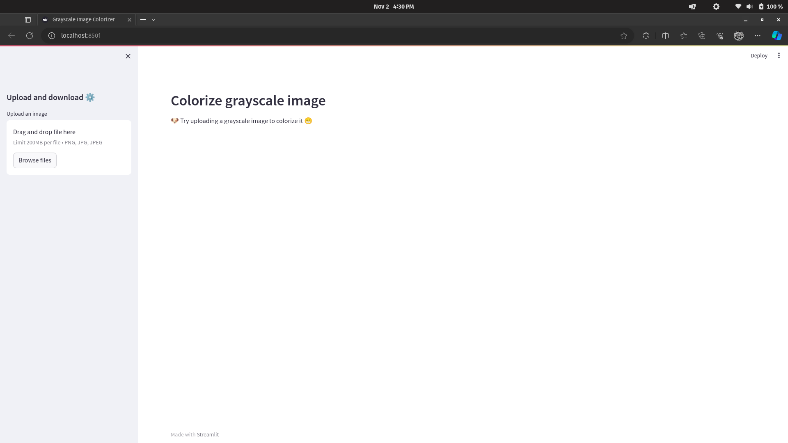
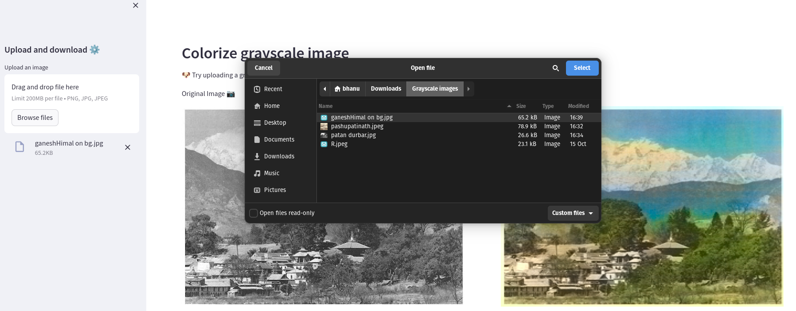
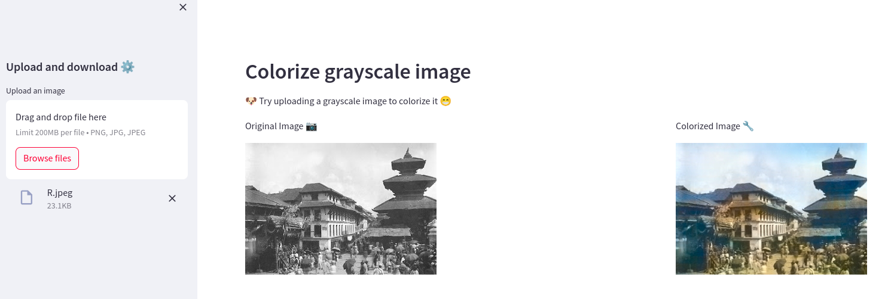
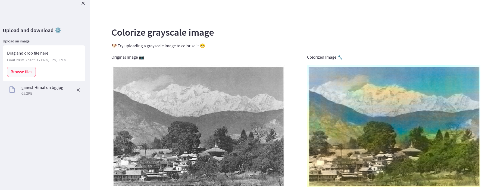

# Image-Colorizer
Here is the drive link to the trained model: https://drive.google.com/file/d/1a9ls2viLDKIld2xgdhcuvBXqNyTGyopG/view?usp=sharing

<h3>How to run it</h3> 

```

  streamlit run UI.py

```
<h3>Results</h3>




